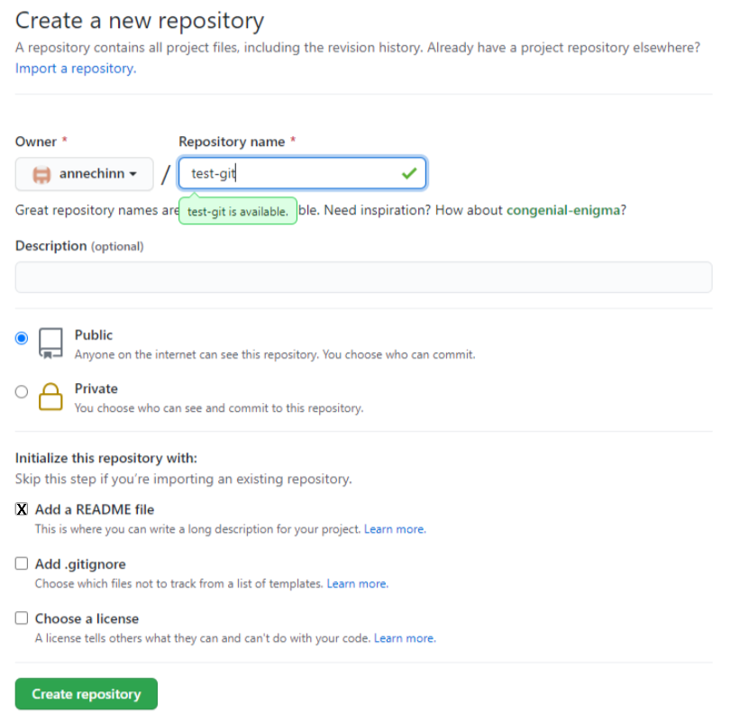

# Creating a new Repo - fresh start
If you haven't created a project on your local computer yet, the easiest way to create a repo that will be connected to GitHub is to start by creating the GitHub repo first.

If you create the GitHub repository first, and check the option to include a README file, then the GitHub repo will be created and the main branch will be set up as the default. This eliminates the need to perform all of the steps when you start from your local computer, which involves creating an initial README file and renaming the master branch to main.

**Note**: You must create an initial file in order for the initial branch to be created. Creating a README file is a good habit to create in your repo, so it's a logical choice.

### 1. Create the new Repo

### 2. Clone the new Repo

Once you have created the repo, you can follow the steps to [clone an exiting GitHub repo](./git-cloning-existing-repo.md).