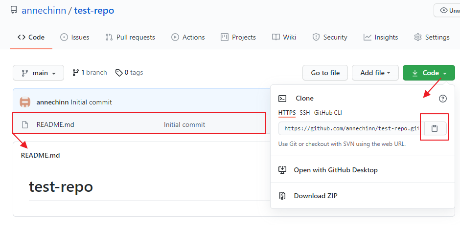

# Git/GitHub 

# Intro

### What is a Version Control System?

A really helpful analogy is a video game. You get to a certain point in the game, and you don't want to lose your current place and have to start over if you die. So you save your game. If something bad happens after that point you can always reload your game and start from that point again. 

This is exactly what happens in a version control system, except that it is called **committing your changes**, instead of saving your game. A change is any code modification\(s\) made since the last commit.

### What is a Repository?

A Repository, or repo, is the collection of files that make up a single project that you would like to have tracked for changes.

### What is git?

**git** is a free and open source, distributed version control system. Git is designed to work with a repository on your local computer. The core functionality allows you to manage and keep track of changes to the collection of files in your repository over time. 

Internet access, or collaboration with other developers, is not required. Git does support sharing repositories with others across the internet, but at its core, **its primary focus is source code control in a local repository**.

### What is GitHub?


Typically, within a development environment, collaboration is integral to the project, and there is a need to have a centralized location for the repository where developers share their work and can ensure automatic backups. This is where **GitHub** comes in.

**GitHub** is a cloud-based hosting service that lets you store and manage git repositories, and is the most popular solution used by software developers to work collaboratively on software projects.  **GitHub** is know as the place where the development community shares open source projects (the code is accessible and can be used by anyone). 

**GitHub** is free until you need more advanced features. There are other sites, such as **Bitbucket**, that provide similar services, but they focus more on meeting the needs of companies that want their repositories to be private and provide added tools for a paid members.

### Why do you Need a Version Control System?

This [video](https://www.youtube.com/watch?v=rbZf3lPMOYY&list=PLVYDhqbgYpYXbAL\_Hps1Y--THRmaTFipj&index=9) provides a very good overview of why individuals, and/or teams use a version control system.

# Working with Repositories

## Cloning From an Existing GitHub Repo

Whenever you want to work in a repository that already exists on GitHub, the first step is to clone the repository.

Cloning a repository creates a copy of a GitHub repository on your local computer and establishes a connection between the two repositories so that they can stay in sync.

### 1. Get the GitHub repository URL
To clone a GitHub repository, you need to first go to the GitHub repository to get the repository URL. Just click the Code button, and then click the clipboard icon to copy the URL for the repo.




### 2. Issue the git clone command on your local computer

There are two options for how to clone your assignment repository.

#### From the Command Line

Before issuing the git clone command, make sure your current directory is where you want the repository folder to be created. 

One disadvantage of doing this from the command line, is that the Bash Shell doesn't paste without using the right mouse button to bring up the context menu and then selecting the Paste option from that menu.

So, first you would type git clone on the command line, then use the context menu to paste in the GitHub repository URL as the second argument and then enter.

```bash
git clone https://github.com/annechinn/test-repo.git

```

#### From Visual Studio Code

When VS Code first starts up, you are presented with a welcome screen that gives you the option of cloning a repository.


After you click on either of the links shown above, you will be presented with a box to paste in the assignment URL.


This will then automatically clone the GitHub repository and load the project.

## Staring a new Repo from a Local Repo

You have a project on your local computer and now you want to also store the repository on GitHub.

In this scenario you need do the following:

### 1. Create a Local Git Repo
* **git init** - initialize your project folder to be a git repo.
* **git add .** - add all the files in your project to the staging area for the next commit.
* **git commit -m"your comments"** - commit your changes, creating a snapshot of project.

### 2. Create a GitHub Repo
* create a repo on GitHub that will connect with your local repo.
* copy the URL for the new repo
* **git remote add origin [GitHub repo URL]** - connect local repo with GitHub repo
* **git branch -M main** - rename master to main
* **git push -u origin main** - push changes to GitHub


The **git remote add origin [GitHub repo URL]** is connecting the local repository with the GitHub repository. The term **origin** is telling git what to call the remote GitHub repository. You could use any label you want, but **origin** is the convention. This label is necessary so that future commands, such as **push origin**, can tell git what remote GitHub repository the command is targeting.

The second command **git branch -M main** is necessary because git historically named the default branch "master" and about six months ago, they decided to change the default branch name to **main**. 

## Creating a new Repo - fresh start
If you haven't created a project on your local computer yet, the easiest way to create a repo that will be connected to GitHub is to start by creating the GitHub repo first.

If you create the GitHub repository first, and check the option to include a README.md file, then the GitHub repo will be created and the main branch will be set up as the default. This eliminates the need to perform all of the steps when you start from your local computer, which are just creating that initial file and the main branch on the command line.

### 1. Create the new Repo


### 2. Clone the new Repo


# Resources
* [Git Crash Course for Beginners](https://youtu.be/SWYqp7iY_Tc)
* [Git Cheat Sheet](https://education.github.com/git-cheat-sheet-education.pdf)


