# VS Code Intro

Visual Studio Code is the source code editor we will be using in the class. It  is very popular among web developers. It is very well designed and easy to learn. One of the biggest reasons for its success is that it has a huge library of extensions (plug-ins) that can be added to make you more productive.

This [video](https://www.youtube.com/watch?v=ORrELERGIHs) is a good overview of the core functionalities in VS Code.

### Confiruation Settings
For each of these settings, use the Command Pallet to bring up the settings.
* Set Git Bash as your Default Terminal Shell
**Terminal: Select Default Profile**, and then select **Git Bash**
* Set editor word wrap to on
**View: Toggle Word Wrap** to on

## Essential Extensions

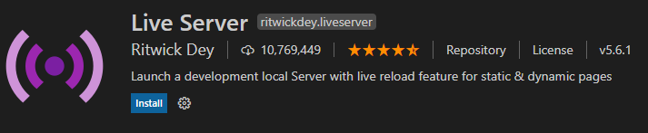
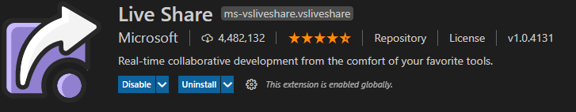
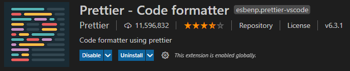
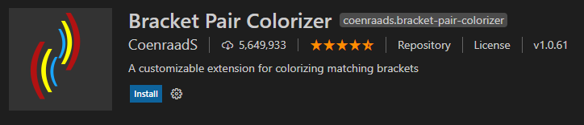
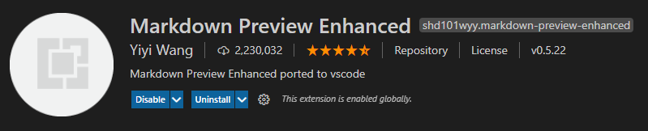

## Popular Editor Themes
These supply syntax and background coloring, as well as icons for different file types in the File Explorer View.

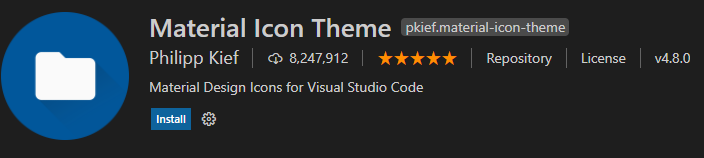

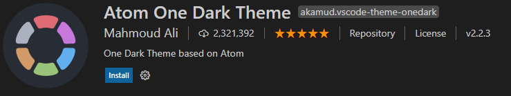

## JavaScript Extensions
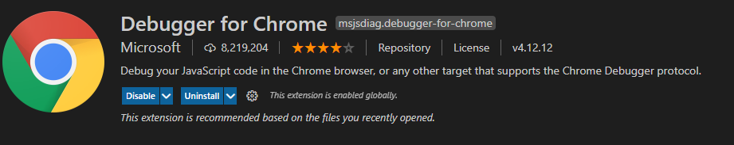
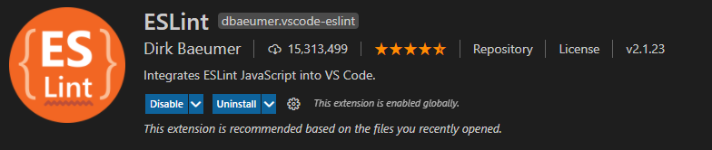
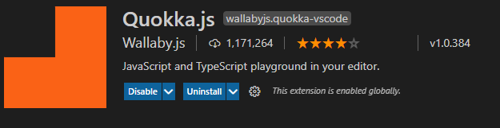
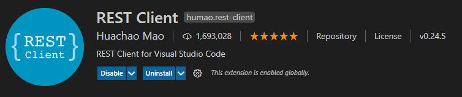

## Resources
* [VS Tutorial](https://www.youtube.com/watch?v=ORrELERGIHs)
* [VS Shortcuts](https://travis.media/10-vs-code-shortcuts-to-memorize-that-will-boost-your-productivity/)
* [Emmet](https://dev.to/raaynaldo/speed-up-code-your-html-using-emmet-in-vscode-nesting-operators-201o)
* [Emmet Cheatsheet](https://docs.emmet.io/cheat-sheet/)

